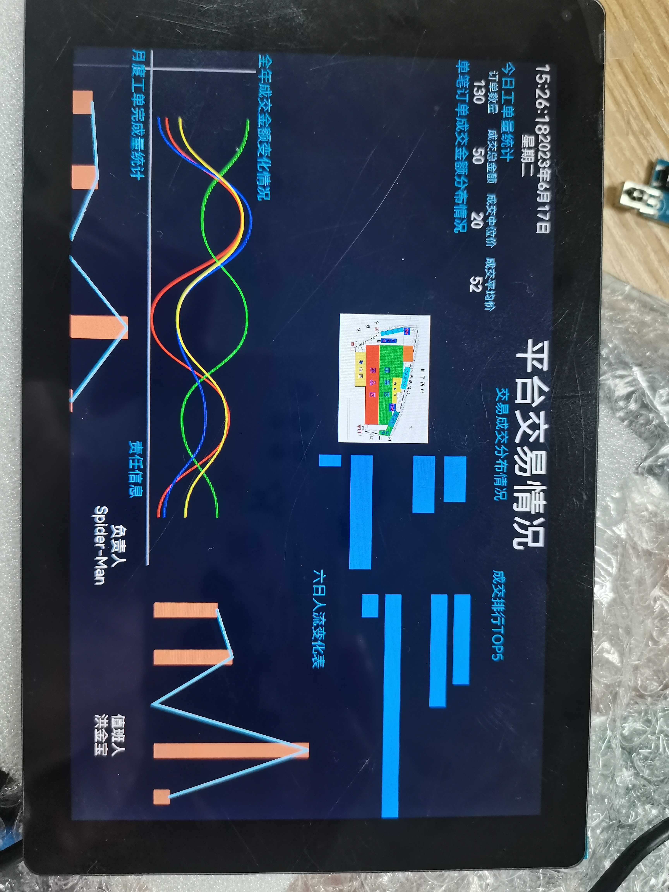

## 交易信息大屏
> 用于展示交易信息的交易大屏。
> 通过折线图、条形图等可视化的信息
> 展示每日工单数量、交易分布情况、成交排行榜TOP5、全年成交金额、人流情况等有助于农贸菜场管理者对菜场的经营状况分析的数据。

## 运行截图

## 运行条件
> 列出运行该项目所必须的条件和相关依赖  
* 确保开发板正确连接网络

## 运行说明
> 说明如何运行和使用你的项目，建议给出具体的步骤说明
* 使用DevEco Studio 编译运行项目

## 技术实现
开发板：Purple Pi OH 、DAYU200

api版本：3.2 Release

IDE：3.1.1 Release

